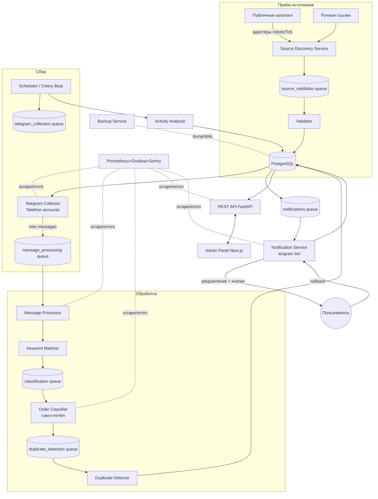

# Техническая спецификация: сервис поиска заказов на разработку сайтов в публичных Telegram-каналах

**Кодовое имя:** `tg-order-radar`
**Версия документа:** 1.0
**Целевые версии стека:** Python 3.12+, PostgreSQL 16, Redis 7, Telethon 1.36+, FastAPI 0.111+, SQLAlchemy 2.0, Celery 5.4

> Документ описывает production-ready архитектуру. Все решения относятся **только к публично доступным** Telegram-каналам и группам (наличие `username` у сущности). Обход ограничений Telegram, CAPTCHA, антибот-защиты каталогов, доступ к закрытым чатам и массовая рассылка сообщениям пользователям **не предусмотрены и запрещены на уровне архитектуры**.

---

## 1. Краткое описание системы

### Назначение
Сервис автоматически обнаруживает и агрегирует сообщения-заказы на разработку сайтов (лендинги, корпоративные сайты, интернет-магазины, визитки, доработка, frontend/backend/full-stack, редизайн, интеграции с CRM/платёжными системами/API), опубликованные в **публичных** русскоязычных Telegram-каналах и группах за **последние 7 календарных дней**. Отсеивает рекламу исполнителей, резюме, вакансии без задачи, спам и дубли; ранжирует заказы по релевантности; уведомляет пользователя через отдельного Telegram-бота.

### Типы пользователей
| Роль | Права |
|------|-------|
| `admin` | Полный доступ: управление источниками, каталогами, ключевыми словами, аккаунтами, системными настройками, просмотр аудита. |
| `operator` (модератор) | Просмотр заказов, ручная модерация, изменение статусов, управление ключевыми словами, избранное. |
| `viewer` | Только чтение заказов и статистики, получение уведомлений. |
| `service` (машинный) | Внутренние сервисы (collector, workers) — доступ по service-токенам с ограниченным scope. |

### Основные сценарии использования
1. **Onboarding источника.** Admin добавляет ссылку на канал / импортирует список из каталога → система проверяет публичность → ставит источник в очередь сбора.
2. **Непрерывный сбор.** Collector слушает новые сообщения публичных источников → отправляет в очередь обработки.
3. **Классификация.** Pipeline определяет, является ли сообщение реальным заказом, тип проекта, бюджет, срок, контакт, релевантность.
4. **Уведомление.** Заказ с `relevance_score ≥ порога` и `published_at ≥ now-7d`, не являющийся дублем, отправляется в Telegram-бот с интерактивными кнопками.
5. **Работа оператора.** Оператор просматривает ленту заказов, фильтрует, добавляет в избранное, отмечает «связался»/«неактуально», экспортирует.

### Ключевой результат
Отранжированная, дедуплицированная лента актуальных (≤7 дней) заказов с карточкой вида (см. пример в ТЗ): источник, дата, тип проекта, описание, бюджет, срок, контакт, `relevance_score`, `activity_score`, статус, прямая ссылка на оригинал.

---

## 2. Функциональные требования

Формат: **Назначение / Вход / Результат / Ошибки / Граничные случаи.**

### FR-1. Добавление Telegram-источника
- **Назначение:** зарегистрировать публичный канал/группу для мониторинга.
- **Вход:** `t.me/<username>`, `@username`, `https://t.me/joinchat/...` (последнее — отклоняется как приватное), либо числовой ID (только для уже разрешённых публичных сущностей).
- **Результат:** запись в `telegram_sources` со статусом `pending_validation`.
- **Ошибки:** невалидный URL (`422`), приватная сущность (`409 SOURCE_NOT_PUBLIC`), дубль (`409 SOURCE_EXISTS`), сущность не найдена (`404`).
- **Граничные случаи:** ссылка на пост (`t.me/x/123`) → извлечь `x`; ссылка на бота → отклонить; переименованный канал (username сменился) → сопоставление по `tg_peer_id`.

### FR-2. Импорт источников из публичных каталогов
- **Назначение:** массово загрузить кандидатов из разрешённых каталогов (через адаптеры, соблюдающие robots.txt/ToS).
- **Вход:** `catalog_id`, поисковый запрос/категория, лимит.
- **Результат:** записи в `source_catalog_items` (статус `discovered`), кандидаты — в `telegram_sources` (`pending_validation`) после дедупликации.
- **Ошибки:** каталог отключён (`403 CATALOG_DISABLED`), rate limit каталога (`429`, backoff), robots.txt запрещает путь (`403 DISALLOWED_BY_ROBOTS`).
- **Граничные случаи:** каталог отдаёт приватные/несуществующие юзернеймы → фильтруются на этапе валидации; пагинация обрывается → сохраняется cursor для докачки.

### FR-3. Проверка доступности источника
- **Назначение:** убедиться, что сущность публична и доступна для чтения.
- **Вход:** `source_id`.
- **Результат:** обновление `is_public`, `access_status` (`ok|not_found|private|banned|restricted`), `title`, `participants_count`, `last_checked_at`.
- **Ошибки:** `ChannelPrivateError`, `UsernameNotOccupiedError`, `FloodWaitError` (переносит проверку), сетевая ошибка (retry).
- **Граничные случаи:** канал стал приватным после добавления → `access_status=private`, снимается со сбора; ребрендинг username → обновить.

### FR-4. Сбор новых сообщений
- **Назначение:** получать новые публичные сообщения с момента последнего offset.
- **Вход:** `source_id`, `last_seen_message_id`.
- **Результат:** записи в `messages` (raw), события в очередь `message_processing`.
- **Ошибки:** `FloodWaitError` → sleep на указанное время; `ChannelPrivateError` → пометить источник; `RPCError` → retry с backoff.
- **Граничные случаи:** длинный gap (аккаунт был оффлайн) → backfill с ограничением по глубине (7 дней + буфер); отредактированное сообщение → апдейт; удалённое → soft-delete.

### FR-5. Поиск по ключевым словам (Keyword Matcher)
- **Назначение:** быстрый первичный фильтр «похоже на заказ».
- **Вход:** нормализованный текст, активные `keywords`/`negative_keywords`.
- **Результат:** `keyword_hits[]`, `negative_hits[]`, флаг `passed_prefilter`.
- **Ошибки:** пустой текст (медиа без подписи) → `passed_prefilter=false`.
- **Граничные случаи:** ключевое слово внутри URL/хэштега → учитывать границы слова; опечатки → опциональный fuzzy-матч (расстояние Левенштейна ≤1 для слов ≥6 символов).

### FR-6. Классификация сообщений
- **Назначение:** отнести сообщение к одному из классов (реальный заказ / вакансия / реклама услуг / резюме / партнёрка / спам / обсуждение / нерелевантное).
- **Вход:** нормализованный текст, keyword-хиты, сущности.
- **Результат:** `classifications` запись: `label`, `confidence`, `method` (`rules|ml|llm|manual`).
- **Ошибки:** LLM недоступна → фолбэк на rules+ml; таймаут → сообщение в `manual_review`.
- **Граничные случаи:** смешанные сообщения (заказ + реклама) → приоритет «заказ» при явной потребности; низкая уверенность (`0.4–0.6`) → ручная модерация.

### FR-7. Фильтрация заказов за последние 7 дней
- **Назначение:** учитывать только свежие заказы.
- **Вход:** `message.date` (UTC), `now`.
- **Результат:** флаг `is_fresh = (now - date) ≤ 7 дней`.
- **Ошибки:** отсутствует дата → берётся `collected_at` с пометкой `date_estimated=true`.
- **Граничные случаи:** пересланное старое сообщение с новой датой пересылки → использовать `fwd_from.date` оригинала, если доступна; сообщение на границе 7 суток пересчитывается ежесуточным `maintenance`-джобом (переходит в архив).

### FR-8. Определение активности каналов/групп — см. §7.

### FR-9. Удаление дублей — см. §10.

### FR-10. Оценка релевантности заказа — см. §9.

### FR-11–12. Управление ключевыми / исключающими словами
- **Назначение:** CRUD словарей без передеплоя.
- **Вход:** слово/фраза, `lang`, `weight`, `category`, `is_regex`, `enabled`.
- **Результат:** запись в `keywords`/`negative_keywords`; горячая перезагрузка словаря воркерами (через Redis pub/sub `dict:reload`).
- **Ошибки:** невалидное regex (`422`), дубль (`409`).
- **Граничные случаи:** конфликт (слово одновременно в keywords и negative) → negative имеет приоритет; изменение весов не перерассчитывает историю автоматически (только по явному reindex-джобу).

### FR-13–14. Просмотр и фильтрация заказов
- **Назначение:** лента с фильтрами.
- **Вход:** фильтры `date_from/to`, `budget_min/max`, `project_type[]`, `relevance_min`, `source_id`, `status[]`, `q` (полнотекст), сортировка, пагинация.
- **Результат:** страница `orders` + агрегаты.
- **Ошибки:** невалидный фильтр (`422`).
- **Граничные случаи:** бюджет «договорная» (null) → отдельный флаг `budget_negotiable`; пустая выборка → `200` с пустым списком.

### FR-15. Уведомления через Telegram-бот — см. §16.

### FR-16. Ручная модерация
- **Назначение:** оператор подтверждает/отклоняет спорные сообщения.
- **Вход:** `message_id`, решение (`confirm_order|reject|change_type`), опц. корректировка полей.
- **Результат:** обновление `orders`/`classifications` (`method=manual`), запись в `audit_logs`; корректировки формируют датасет для дообучения ML.
- **Ошибки:** конфликт версий (оптимистическая блокировка `updated_at`) → `409`.
- **Граничные случаи:** оператор подтверждает уже отправленный дубль → не создаёт повторное уведомление.

### FR-17. Избранное
- **Вход:** `user_id`, `order_id`. **Результат:** запись в `favorites` (уникальна). **Ошибки:** дубль → идемпотентно `200`. **Граничное:** избранный заказ, ушедший в архив по 7-дневному правилу, остаётся доступен в разделе «Избранное».

### FR-18. Изменение статуса заказа
- **Вход:** `order_id`, `status ∈ {new, viewed, contacted, irrelevant, archived}`, опц. комментарий.
- **Результат:** обновление `orders.status`, `audit_logs`.
- **Ошибки:** недопустимый переход (`422`, см. state-machine §11).
- **Граничное:** параллельное изменение двумя операторами → оптимистическая блокировка.

### FR-19. Экспорт результатов
- **Вход:** те же фильтры, формат `csv|xlsx|json`.
- **Результат:** файл (стрим для больших выборок), запись в `audit_logs`.
- **Ошибки:** слишком большой объём (`413`, предлагается сузить фильтр или async-экспорт через `parser_jobs`).
- **Граничное:** экспорт >50k строк выполняется как фоновая задача с уведомлением по готовности.

---

## 3. Нефункциональные требования

| Категория | Требование (измеримое) |
|-----------|------------------------|
| **Производительность** | Обработка сообщения (от получения collector'ом до записи `orders`) — p95 ≤ **10 с**, p99 ≤ 30 с при штатной нагрузке. Пропускная способность pipeline ≥ **50 msg/s** на 1 воркере classification. |
| **Скорость появления заказа** | От публикации в Telegram до появления в системе и отправки уведомления — **≤ 60 с** для источников на realtime-подписке; ≤ 5 мин для polling-источников. |
| **Масштабируемость** | Горизонтальное масштабирование воркеров Celery и collector-инстансов. Целевой объём: **до 3 000 источников**, **до 300 000 сообщений/сутки** без изменения архитектуры. Партиционирование `messages` по месяцам. |
| **Отказоустойчивость** | Отказ любого воркера не теряет задачи (Redis persistence + `acks_late` + dead-letter). Отказ collector-инстанса → задачи подхватывает другой (по source-lease). Целевая доступность API — **99.5%/мес**. |
| **Безопасность** | См. §17. Секреты только в vault/env, не в репозитории. Все внешние входы валидируются Pydantic. TLS обязателен. |
| **Логирование** | Структурированные JSON-логи, `correlation_id` сквозной, retention 30 дней (горячие) + 90 дней (архив S3). |
| **Мониторинг** | Prometheus scrape каждые 15 с; алерты на очереди, ошибки, лаг сбора; Sentry для исключений. |
| **Резервное копирование** | PostgreSQL: WAL-архивирование + ежедневный дамп; RPO ≤ **15 мин**, хранение 14 дней. Session-файлы Telegram — в шифрованном виде, бэкап отдельно. |
| **Восстановление после сбоя** | RTO ≤ **1 час** (восстановление БД из бэкапа + WAL, перезапуск сервисов). Runbook в `docs/runbooks/`. |
| **Конфиденциальность** | Сбор только публичных данных. Минимизация ПДн: контакты хранятся, но перед отправкой в стороннюю LLM обезличиваются (маскирование @username, телефонов, email). Право на удаление источника/данных. |
| **Хранение данных** | Сырые сообщения — 90 дней, затем архив/удаление; заказы — 365 дней; аудит — 365 дней. |
| **Допустимый процент ошибок** | Классификация: precision по классу «реальный заказ» ≥ **0.85**, recall ≥ 0.70 на валидационном наборе. Потеря сообщений pipeline < **0.1%**. Ошибки Telegram API (не FloodWait) < 1% вызовов. |

---

## 4. Технологический стек

| Компонент | Технология | Обоснование | MVP | Prod |
|-----------|-----------|-------------|:---:|:---:|
| Язык | **Python 3.12** | Экосистема Telethon/async, типизация, зрелость. | ✅ | ✅ |
| Telegram MTProto | **Telethon 1.36+** | Полноценный MTProto-клиент, events, session-хранилища, FloodWait. | ✅ | ✅ |
| API | **FastAPI 0.111+** | Async, OpenAPI из коробки, Pydantic-валидация. | ✅ | ✅ |
| Валидация/схемы | **Pydantic v2** | Быстрая валидация, единые схемы API/настроек. | ✅ | ✅ |
| ORM | **SQLAlchemy 2.0** (async) | Зрелость, типизированный 2.0-стиль, миграции. | ✅ | ✅ |
| Миграции | **Alembic** | Версионирование схемы. | ✅ | ✅ |
| БД | **PostgreSQL 16** | JSONB, полнотекст (`tsvector`), партиционирование, `pg_trgm`, надёжность. | ✅ | ✅ |
| Векторное сходство | **pgvector** | Дедуп по эмбеддингам без отдельной БД; при росте — вынести в Qdrant. | ⬜ | ✅ |
| Кэш/брокер | **Redis 7** | Брокер Celery, кэш словарей, distributed lock, dedup-set. | ✅ | ✅ |
| Очереди/задачи | **Celery 5.4** | Зрелый воркер-фреймворк, роутинг очередей, retry, beat. | ✅ | ✅ |
| Планировщик | **Celery Beat** (+ `redbeat` для HA) | Периодические задачи (валидация, активность, maintenance). | ✅ | ✅ |
| Классификация ML | **scikit-learn** (LogReg/LinearSVC на TF-IDF) | Лёгкая, интерпретируемая базовая модель. | ⬜ | ✅ |
| LLM (опц.) | Внешний LLM через абстракцию | Доп. этап для спорных случаев; данные обезличиваются. | ⬜ | ✅(опц.) |
| Эмбеддинги | `sentence-transformers` (multilingual, локально) | Дедуп/семантика без утечки данных вовне. | ⬜ | ✅ |
| Frontend | **Next.js 14 + TypeScript** | SSR/ISR, роутинг, единый деплой админки. | ⬜ | ✅ |
| UI-kit | Tailwind + shadcn/ui | Быстрая сборка админки. | ⬜ | ✅ |
| Бот уведомлений | **aiogram 3** (Bot API) | Отдельный бот, inline-кнопки, вебхук/поллинг. | ✅ | ✅ |
| Reverse proxy | **Traefik v3** | Авто-TLS (ACME), динамический роутинг, labels в Compose. | ⬜ | ✅ |
| Метрики | **Prometheus** | Стандарт для pull-метрик. | ⬜ | ✅ |
| Дашборды | **Grafana** | Визуализация, алерты. | ⬜ | ✅ |
| Ошибки | **Sentry** | Трейсинг исключений, релизы. | ⬜ | ✅ |
| Контейнеризация | **Docker + Docker Compose** | Локальная разработка и single-VPS prod. | ✅ | ✅ |
| CI/CD | **GitHub Actions** | Линт/тесты/сборка/деплой. | ⬜ | ✅ |

**MVP-минимум:** Python, Telethon, FastAPI, Pydantic, SQLAlchemy, Alembic, PostgreSQL, Redis, Celery, Celery Beat, aiogram-бот, Docker Compose, rules-классификатор. **Production добавляет:** ML/LLM/эмбеддинги, pgvector, Next.js-админку, Traefik+TLS, Prometheus/Grafana/Sentry, GitHub Actions, партиционирование и бэкап-контур.

*Ограничения стека (не скрываем):* Telethon работает через userbot-аккаунты — это ограничивает частоту вызовов (FloodWait) и создаёт риск блокировки при агрессивном поведении; `SearchGlobal` в MTProto ограничен и не заменяет полноценный индекс каталогов; scikit-learn TF-IDF слаб на очень коротких/зашумлённых текстах — поэтому обязателен гибрид с правилами.

---

## 5. Общая архитектура

### 5.1 Компоненты

| Компонент | Ответственность | Вход | Выход | Взаимодействие | Точки отказа | Восстановление |
|-----------|-----------------|------|-------|----------------|--------------|----------------|
| **Source Discovery Service** | Импорт кандидатов из каталогов через адаптеры (robots/ToS-aware). | catalog query | кандидаты источников | → БД, → `source_validation` | недоступность каталога, смена HTML | адаптер отключается, retry с backoff, ручной ввод как фолбэк |
| **Telegram Collector** | Подписка/поллинг публичных источников, сбор новых сообщений. | список источников, offset | raw messages | ← БД(sources), → `message_processing` | FloodWait, бан аккаунта, разрыв MTProto | ротация аккаунтов, reconnect, source-lease переезжает на живой инстанс |
| **Scheduler (Celery Beat)** | Периодические задачи: валидация, активность, maintenance, 7-дневный пересчёт. | cron-расписание | задачи в очереди | → все очереди | одиночный beat | `redbeat` + Redis lock для HA |
| **Message Queue (Redis/Celery)** | Транспорт задач между стадиями. | задачи | задачи | все воркеры | потеря брокера | Redis AOF-persistence, `acks_late`, DLQ |
| **Message Processor** | Оркестрация pipeline: нормализация → префильтр → сущности. | raw message | обогащённое сообщение | ← queue, → `classification` | падение воркера | idempotent by (source, tg_msg_id), `acks_late` |
| **Keyword Matcher** | Префильтр по ключевым/исключающим словам. | текст, словари | hits, флаги | внутри Processor | устаревший словарь | hot-reload через Redis pub/sub |
| **Order Classifier** | Гибридная классификация (rules→ml→llm→manual). | текст, hits, сущности | label+confidence | ← queue, → `duplicate_detection` | недоступность LLM | фолбэк на rules/ml, спорное → manual_review |
| **Duplicate Detector** | Обнаружение дублей (id/hash/similarity). | заказ-кандидат | duplicate_group_id | ← queue, → `notifications` | ложные слипания/расклейки | пороги + ручной разбор |
| **Activity Analyzer** | Расчёт Activity Score источников. | статистика сообщений | activity_score, status | периодически из Scheduler | тяжёлые агрегаты | оконный пересчёт, кэш |
| **Database (PostgreSQL)** | Хранилище всех сущностей. | — | — | все компоненты | отказ узла | реплика/бэкап+WAL, RTO≤1ч |
| **REST API (FastAPI)** | Доступ фронта/интеграций. | HTTP | JSON | ← БД, ← Redis | перегрузка | rate limit, health checks, автоперезапуск |
| **Admin Panel (Next.js)** | UI управления и просмотра. | HTTP | UI | ↔ API | — | статический деплой, независим от воркеров |
| **Notification Service (aiogram)** | Отправка уведомлений и обработка кнопок. | заказ-событие | сообщение боту | ← `notifications`, ↔ БД | лимиты Bot API | очередь+throttle, ретраи |
| **Monitoring/Logging** | Метрики, логи, алерты, трейсы. | телеметрия | дашборды/алерты | все | — | независимый стек |
| **Backup Service** | Дампы БД, WAL, шифр. session-бэкапы. | расписание | артефакты в S3 | ← БД, ← session storage | сбой бэкапа | алерт «backup failed», проверка восстановления |

### 5.2 Mermaid-диаграмма



---

## 6. Источники данных

Только публичные сущности (у канала/группы есть `username`). Механизмы обнаружения:

### 6.1 Ручное добавление
Оператор вводит `t.me/<username>` или `@username`. Пайплайн нормализации:
1. Извлечь username из любых форм (`https://t.me/x`, `t.me/x/123`, `@x`).
2. Отклонить приватные формы (`t.me/joinchat/...`, `t.me/+...`) → `SOURCE_NOT_PUBLIC`.
3. Через Telethon `get_entity(username)` получить сущность; проверить `entity.username is not None` и тип (`Channel`/`Chat` broadcast/megagroup).

### 6.2 Импорт из публичных каталогов (адаптеры)
Каждый каталог = отдельный адаптер, реализующий интерфейс:

```python
class CatalogAdapter(Protocol):
    slug: str
    enabled: bool
    async def is_allowed(self, path: str) -> bool: ...   # проверка robots.txt (кэш)
    async def search(self, query: str, cursor: str | None, limit: int
                     ) -> CatalogPage: ...               # уважает rate limit, ToS
```

Правила для адаптеров (обязательны):
- Перед запросом — проверка `robots.txt` (кэш 24 ч) и соблюдение `Crawl-delay`.
- Соблюдение публичных условий использования каталога; при их изменении/запросе владельца — отключение адаптера (`enabled=false`) без правок кода.
- Rate limit на адаптер (напр. ≤1 req/сек, конфигурируемо), экспоненциальный backoff на `429/5xx`.
- Никакого обхода CAPTCHA, антибота, авторизации, платных стен. Если каталог требует обход — адаптер помечается `unsupported`.
- Результаты каталога — только кандидаты; **факт публичности подтверждается через Telethon-валидацию**, а не по данным каталога.

Хранение: `source_catalogs` (метаданные каталога и его политика), `source_catalog_items` (сырые находки с `raw_payload`, `discovered_at`).

### 6.3 Поиск через возможности Telegram (легально)
- `contacts.SearchRequest(q=<ключевая фраза>, limit=N)` — возвращает публичные чаты/каналы/пользователей по названию. Используется как источник кандидатов, не для скрейпинга закрытого.
- Кандидаты дедуплицируются и проходят валидацию публичности.
- Глобальный поиск сообщений (`messages.SearchGlobalRequest`) применяется ограниченно (лимиты MTProto) — как вспомогательный сигнал, не как основной механизм.

### 6.4 Проверка публичности, нормализация, дубли
- **Нормализация ссылки:** к канону `@username` (lowercase), плюс сохранение `tg_peer_id` и `access_hash` для устойчивости к смене username.
- **Проверка дублей:** уникальность по `tg_peer_id` (главный ключ идентичности) и по `normalized_username`. Если username сменился, а peer_id совпал — обновляем username, не создаём дубль.
- **Периодическое обновление статуса:** задача `source_validation` по расписанию (напр. каждые 6 ч + при ошибках сбора) обновляет `access_status`, `title`, `participants_count`.

---

## 7. Алгоритм определения активности источника

`Activity Score` ∈ [0, 100] на окне 7 дней. Считается периодически (раз в 3–6 ч) `Activity Analyzer`.

### Показатели и веса

| Обозн. | Показатель | Нормализация в [0,1] | Вес |
|--------|-----------|----------------------|-----|
| `V` | Кол-во сообщений за 7 дней (`msg_count_7d`) | `min(msg_count_7d / 200, 1)` | 0.20 |
| `O` | Кол-во сообщений-кандидатов на заказ за 7 дней | `min(order_candidates_7d / 40, 1)` | 0.30 |
| `R` | Свежесть последнего сообщения | `max(0, 1 - hours_since_last / 168)` | 0.15 |
| `Reg` | Регулярность (доля из 7 дней, где были посты) | `active_days_7d / 7` | 0.15 |
| `Rel` | Доля релевантных среди кандидатов | `relevant_orders_7d / max(order_candidates_7d,1)` | 0.20 |
| `Noise` | Штраф за спам/дубли | `min((spam_7d + dup_7d) / max(msg_count_7d,1), 1)` | −0.15 |

### Формула
```
raw = 0.20*V + 0.30*O + 0.15*R + 0.15*Reg + 0.20*Rel - 0.15*Noise
activity_score = round( clamp(raw, 0, 1) * 100 )
```

### Пороги статусов
| Score | Статус | Политика сбора |
|-------|--------|----------------|
| 0–19 | `inactive` | polling раз в 24 ч, кандидат на отключение |
| 20–49 | `low` | polling раз в 3 ч |
| 50–74 | `active` | polling раз в 30 мин / realtime если megagroup |
| 75–100 | `high` | realtime-подписка, приоритет |

### Примеры расчёта
**Пример A (активный канал заказов):** `V=180→0.9, O=35→0.875, R: last=2ч→0.988, Reg=7/7=1.0, Rel=20/35=0.571, Noise=3/180=0.017`
```
raw = 0.20*0.9 + 0.30*0.875 + 0.15*0.988 + 0.15*1.0 + 0.20*0.571 - 0.15*0.017
    = 0.18 + 0.2625 + 0.1482 + 0.15 + 0.1143 - 0.0025 = 0.8525 → 85 → high
```
**Пример B (заброшенная группа):** `V=8→0.04, O=1→0.025, last=200ч→R=0, Reg=2/7=0.286, Rel=0/1=0, Noise=1/8=0.125`
```
raw = 0.008 + 0.0075 + 0 + 0.0429 + 0 - 0.0188 = 0.0396 → 4 → inactive
```
**Пример C (спамный чат):** `V=500→1.0, O=10→0.25, last=1ч→0.994, Reg=1.0, Rel=1/10=0.1, Noise=(300+50)/500=0.7`
```
raw = 0.20 + 0.075 + 0.149 + 0.15 + 0.02 - 0.105 = 0.489 → 49 → low
```
(высокий объём гасится штрафом за шум — корректное поведение).

---

## 8. Алгоритм определения заказа (pipeline)

Каждое сообщение проходит стадии; ранний выход экономит ресурсы.

```
raw msg
 └─(1) Нормализация текста
 └─(2) Определение языка (fast-langdetect) → не ru/uk? → downweight, но не отбрасывать сразу
 └─(3) Keyword Matcher: поиск ключевых фраз → нет попаданий → класс "нерелевантное", stop
 └─(4) Negative Matcher: исключающие фразы → сильный сигнал "реклама/резюме"
 └─(5) NER/сущности: бюджет, срок, контакт, стек, тип проекта
 └─(6) Определение типа проекта (правила по словарю)
 └─(7) Поиск бюджета (regex валют/чисел)
 └─(8) Поиск сроков (regex дат/периодов)
 └─(9) Поиск контактов (@username, tg-ссылка, телефон, email)
 └─(10) Классификация (rules → ml → llm)
 └─(11) Расчёт Relevance Score (§9)
 └─(12) Дедупликация (§10)
 └─(13) Ручная модерация при 0.4 ≤ confidence ≤ 0.6
```

### 8.1 Нормализация текста
- Unicode NFC, приведение к нижнему регистру для матчинга (оригинал сохраняется).
- Удаление эмодзи-мусора, схлопывание пробелов/переносов, раскрытие частых сокращений («срочн» → «срочно»).
- Сохранение оригинала для отображения и хеша; нормализованная версия — для матчинга и дедупа.

### 8.2 Определение языка
`fast-langdetect`/`lingua`; при доле кириллицы ниже порога и языке ≠ ru/uk снижаем score, но пропускаем через классификатор (много заказов пишут смешанно).

### 8.3–8.4 Ключевые и исключающие фразы
Словари из БД (`keywords`, `negative_keywords`), горячая перезагрузка. Матчинг по границам слов + опциональный fuzzy. Примеры позитивных: `нужен сайт`, `ищу разработчика`, `сделать лендинг`, `разработать интернет-магазин`, `бюджет на разработку`. Негативные (реклама исполнителя/резюме): `выполню`, `моё портфолио`, `делаю сайты недорого`, `опыт N лет`, `пишите в лс закажу`, `ищу работу`, `резюме`.

### 8.5 Выделение сущностей — см. §8.6–8.9 ниже.

### 8.6 Тип проекта (правила)
Словарь категорий → `project_type`:
`landing_page` (лендинг, одностраничник), `corporate_site` (корпоративный сайт), `ecommerce` (интернет-магазин, маркетплейс), `business_card` (визитка), `revision` (доработка, правки, доделать), `frontend`, `backend`, `fullstack`, `redesign` (редизайн), `integration` (CRM/оплата/API). При множественных совпадениях — приоритет по специфичности (ecommerce > corporate > landing).

### 8.7 Бюджет (regex)
Паттерны: `(\d[\d\s.]*)\s*(?:руб|р\.|₽|rub|тыс|k|к|\$|usd|€|eur|бел|тенге|грн)`, диапазоны `от X до Y`, `X-Y`, «до 100к», «бюджет 50 000». Нормализация «к/тыс» → ×1000. Валюта детектируется; отсутствие → `budget_negotiable=true` при маркерах «договорная/по договорённости».

### 8.8 Сроки (regex)
`до <дата>`, `за N дней/недель`, `срочно`, `к <месяц>`, `дедлайн`. Нормализация в `deadline` (date) при однозначности, иначе `deadline_text`.

### 8.9 Контакты
`@[\w\d_]{5,32}`, `t.me/<user>`, телефон `\+?\d[\d\-\s()]{7,}`, email. Приоритет: явный контакт в тексте → автор сообщения (если публичный) → «в комментарии/лс» флаг.

### 8.10 Классификация (гибрид)
Порядок:
1. **Rules-слой** даёт первичный label и `rule_confidence` (сильные негативы → `ad_service`/`resume`; сильные позитивы + потребность → `order`).
2. **ML-слой** (LinearSVC/LogReg на TF-IDF char+word n-grams) уточняет вероятности классов.
3. **LLM-слой** (опционально) для «серой зоны»: короткий промпт-классификатор. **Перед отправкой текст обезличивается**: маскируются `@username`, телефоны, email, ссылки. Персональные данные в LLM не уходят.
4. **Manual** при итоговой `confidence ∈ [0.4, 0.6]`.

Классы: `order` (реальный заказ), `job_vacancy` (вакансия), `ad_service` (реклама услуг исполнителя), `resume` (резюме исполнителя), `partnership` (партнёрское), `spam`, `discussion` (обсуждение без заказа), `irrelevant`.

Комбинирование уверенностей:
```
confidence = 0.4*rule_conf + 0.4*ml_prob + 0.2*llm_prob   # llm_prob=ml_prob если LLM отключена
```

Итог стадии — запись в `classifications`. Только `label == 'order'` идёт в `orders` и далее в дедуп/уведомления.

---

## 9. Система оценки релевантности (Relevance Score)

`relevance_score` ∈ [0, 100] для сообщений класса `order`.

### Факторы и веса
| Фактор | Значение | Вес |
|--------|----------|-----|
| Явная потребность (нужен/ищу/требуется + объект) | 0/1 | 0.18 |
| Конкретная задача (что именно сделать) | 0/1 | 0.16 |
| Наличие бюджета | 0/0.5(договорная)/1 | 0.14 |
| Наличие срока | 0/1 | 0.08 |
| Наличие контакта | 0/1 | 0.10 |
| Соответствие нише (тип проекта распознан) | 0/1 | 0.14 |
| Свежесть (≤7 дней, линейно) | `1 - days/7` | 0.08 |
| Заказчик, а не исполнитель (P(client)) | 0..1 | 0.12 |
| Штраф рекламных признаков | −(0..1) | −0.10 |
| Штраф спам-признаков | −(0..1) | −0.10 |

### Формула
```
raw = 0.18*need + 0.16*task + 0.14*budget + 0.08*deadline + 0.10*contact
    + 0.14*niche + 0.08*freshness + 0.12*p_client
    - 0.10*ad_signals - 0.10*spam_signals
relevance_score = round( clamp(raw, 0, 1) * 100 )
```
`p_client` = 1 − P(исполнитель) из ML/правил (маркеры «выполню», «портфолио» снижают).

### Пороги
| Score | Трактовка | Действие |
|-------|-----------|----------|
| ≥ 80 | Сильный заказ | Уведомление (high priority) |
| 60–79 | Вероятный заказ | Уведомление (обычный) |
| 45–59 | Слабый/неполный | В ленту без уведомления |
| < 45 | Отсев | Не в заказы (или manual) |

### Примеры (5 сообщений)
1. **«Нужен лендинг для строительной компании по готовому дизайну, интеграция формы с CRM. Бюджет 50–80к, до 25 июля. Писать @client»**
 need=1,task=1,budget=1,deadline=1,contact=1,niche=1,fresh=1,p_client=0.95,ad=0,spam=0
 `raw=0.18+0.16+0.14+0.08+0.10+0.14+0.08+0.114 = 1.008→clamp 1.0 → 100`. (пример из ТЗ ≈92 при более строгих сигналах).
2. **«Ищу веб-разработчика на постоянку в штат, з/п по итогам собеседования»** → вакансия, не заказ; если проскочит: need=1,task=0.3,budget=0,deadline=0,contact=0.5,niche=0.5,fresh=1,p_client=0.7 → `raw≈0.18+0.048+0+0+0.05+0.07+0.08+0.084=0.512→51` (в ленту, без уведомления).
3. **«Делаю сайты и лендинги недорого, портфолио в профиле, пишите»** → реклама исполнителя. p_client≈0.1, ad_signals=0.9 → `raw≈ ... -0.09 → ~10 → отсев`.
4. **«Кто может доработать WooCommerce? Нужно починить оплату, срочно, бюджет договорная, @shopowner»** need=1,task=1,budget=0.5,deadline=1,contact=1,niche=1(integration/revision),fresh=1,p_client=0.9 → `raw≈0.18+0.16+0.07+0.08+0.10+0.14+0.08+0.108=0.918→92`.
5. **«Требуется интернет-магазин, детали в ЛС»** need=1,task=0.5,budget=0,deadline=0,contact=0.5,niche=1,fresh=1,p_client=0.8 → `raw≈0.18+0.08+0+0+0.05+0.14+0.08+0.096=0.626→63` (уведомление обычного приоритета).

---

## 10. Дедупликация

Многоуровневая проверка, от дешёвой к дорогой (ранний выход при совпадении):

1. **Точный дубль по идентичности:** `(source_id, tg_message_id)` уникален в `messages` — вставка идемпотентна.
2. **Пересланное сообщение:** если `fwd_from` указывает на уже известный `(orig_peer, orig_msg_id)` → тот же `duplicate_group`.
3. **Хеш нормализованного текста:** `sha256(normalized_text)` — быстрый точный матч кросс-источникового репоста.
4. **SimHash/MinHash** нормализованного текста для near-duplicate (≤ Hamming 3 бита из 64) — устойчив к мелким правкам.
5. **Косинусное сходство эмбеддингов** (`pgvector`, multilingual модель): порог **≥ 0.90** → дубль-кандидат.
6. **Совпадение сильных сущностей:** одинаковый контакт (`@user`/телефон) **И** близкий бюджет (±10%) **И** тот же `project_type` в окне 7 дней → дубль даже при разном тексте (перепост в разных группах).

### Порог и выбор основного (canonical)
- Кандидат считается дублем, если совпал уровень 1–3 **или** (уровень 4 **или** 5) **и** уровень 6 согласуется.
- **Canonical-запись группы** выбирается по правилам:
 1. более раннее `published_at` (первоисточник);
 2. при равенстве — источник с бóльшим `activity_score`;
 3. при равенстве — более полное сообщение (больше распознанных полей: бюджет+срок+контакт).
- Уведомление отправляется **только по canonical**. Прочие члены группы связываются через `duplicate_groups`/`orders.duplicate_group_id`, не порождают уведомлений (FR-16, §16).

---

## 11. Структура базы данных (PostgreSQL 16)

Общие соглашения: PK — `UUID` (`gen_random_uuid()`), таймстемпы `TIMESTAMPTZ` (`created_at`, `updated_at` с триггером), soft-delete через `deleted_at` где нужно. Партиционирование `messages` по `RANGE(date)` помесячно.

### 11.1 Перечень таблиц

| Таблица | Назначение | Ключевые поля | FK | Индексы/ограничения |
|---------|-----------|---------------|----|---------------------|
| `users` | Пользователи админки. | `id`, `email uq`, `password_hash`, `role`, `is_active`, `tg_chat_id`(для уведомлений) | — | `uq(email)`, idx(`role`) |
| `telegram_accounts` | Userbot-аккаунты сбора. | `id`, `label`, `phone_enc`, `api_id_enc`, `api_hash_enc`, `session_ref`, `status`(`active/floodwait/banned/disabled`), `floodwait_until`, `last_used_at` | — | idx(`status`), `uq(label)` |
| `telegram_sources` | Публичные источники. | `id`, `tg_peer_id uq`, `username`, `normalized_username`, `title`, `type`(`channel/megagroup`), `is_public`, `access_status`, `activity_score`, `activity_status`, `poll_mode`, `last_seen_message_id`, `last_checked_at` | `catalog_item_id?` | `uq(tg_peer_id)`, `uq(normalized_username)`, idx(`activity_status`,`access_status`) |
| `source_catalogs` | Каталоги-адаптеры и их политика. | `id`, `slug uq`, `base_url`, `enabled`, `rate_limit_rps`, `robots_checked_at`, `tos_url` | — | `uq(slug)` |
| `source_catalog_items` | Сырые находки из каталогов. | `id`, `raw_username`, `raw_payload jsonb`, `status`(`discovered/promoted/rejected`), `discovered_at` | `catalog_id`, `source_id?` | idx(`catalog_id`,`status`) |
| `messages` (partitioned) | Сырые публичные сообщения. | `id`, `source_id`, `tg_message_id`, `date`, `text`, `normalized_text`, `text_hash`, `simhash bigint`, `embedding vector(384)?`, `fwd_from jsonb`, `edited_at`, `deleted_at`, `collected_at` | `source_id` | `uq(source_id,tg_message_id)`, idx(`date`), GIN(`to_tsvector`), idx(`text_hash`), ivfflat(`embedding`) |
| `message_entities` | Извлечённые сущности. | `id`, `message_id`, `type`(`budget/deadline/contact/stack/project_type`), `value_text`, `value_norm jsonb`, `confidence` | `message_id` | idx(`message_id`,`type`) |
| `orders` | Заказы (label='order'). | `id`, `message_id uq`, `source_id`, `project_type`, `title`, `summary`, `budget_from`, `budget_to`, `budget_currency`, `budget_negotiable`, `deadline`, `deadline_text`, `published_at`, `relevance_score`, `status`, `duplicate_group_id?`, `is_fresh`, `notified_at?` | `message_id`,`source_id`,`duplicate_group_id?` | `uq(message_id)`, idx(`published_at`,`relevance_score`,`status`,`project_type`) |
| `order_contacts` | Контакты заказа. | `id`, `order_id`, `kind`(`username/phone/email/link`), `value`, `is_public` | `order_id` | idx(`order_id`) |
| `keywords` | Ключевые слова/фразы. | `id`, `phrase`, `lang`, `weight`, `category`, `is_regex`, `enabled` | — | `uq(phrase,lang)`, idx(`enabled`) |
| `negative_keywords` | Исключающие слова. | `id`, `phrase`, `lang`, `weight`, `is_regex`, `enabled` | — | `uq(phrase,lang)` |
| `classifications` | Результаты классификации. | `id`, `message_id`, `label`, `confidence`, `method`, `model_version`, `created_at` | `message_id` | idx(`message_id`), idx(`label`) |
| `duplicate_groups` | Группы дублей. | `id`, `canonical_order_id`, `method`, `similarity`, `size` | `canonical_order_id` | idx(`canonical_order_id`) |
| `notifications` | Отправленные уведомления. | `id`, `order_id`, `user_id`, `channel`(`bot`), `status`(`queued/sent/failed`), `sent_at`, `dedup_key uq` | `order_id`,`user_id` | `uq(dedup_key)`, idx(`status`) |
| `user_filters` | Сохранённые фильтры/подписки. | `id`, `user_id`, `name`, `criteria jsonb`, `notify` | `user_id` | idx(`user_id`) |
| `favorites` | Избранное. | `id`, `user_id`, `order_id` | `user_id`,`order_id` | `uq(user_id,order_id)` |
| `audit_logs` | Аудит действий. | `id`, `actor_id?`, `action`, `entity`, `entity_id`, `payload jsonb`, `ip`, `created_at` | `actor_id?` | idx(`entity`,`entity_id`), idx(`created_at`) |
| `parser_jobs` | Фоновые задачи/прогоны. | `id`, `type`, `status`, `params jsonb`, `stats jsonb`, `started_at`, `finished_at` | — | idx(`type`,`status`) |
| `parser_errors` | Ошибки сбора/обработки. | `id`, `job_id?`, `source_id?`, `kind`, `message`, `payload jsonb`, `created_at` | `job_id?`,`source_id?` | idx(`kind`,`created_at`) |
| `system_settings` | Ключ-значение настроек. | `id`, `key uq`, `value jsonb`, `updated_by` | — | `uq(key)` |

### 11.2 State-machine статуса заказа
```
new → viewed → contacted
new → irrelevant
viewed → irrelevant
* → archived   (по 7-дневному правилу или вручную)
```
Недопустимые переходы отклоняются (`422`).

### 11.3 Ключевой DDL (SQL) и SQLAlchemy-модели

```sql
CREATE EXTENSION IF NOT EXISTS pgcrypto;
CREATE EXTENSION IF NOT EXISTS pg_trgm;
CREATE EXTENSION IF NOT EXISTS vector;  -- pgvector (production)

CREATE TABLE telegram_sources (
    id                  UUID PRIMARY KEY DEFAULT gen_random_uuid(),
    tg_peer_id          BIGINT NOT NULL,
    username            TEXT,
    normalized_username TEXT,
    title               TEXT,
    type                TEXT NOT NULL CHECK (type IN ('channel','megagroup')),
    is_public           BOOLEAN NOT NULL DEFAULT TRUE,
    access_status       TEXT NOT NULL DEFAULT 'unknown'
                          CHECK (access_status IN ('unknown','ok','not_found','private','banned','restricted')),
    activity_score      SMALLINT NOT NULL DEFAULT 0 CHECK (activity_score BETWEEN 0 AND 100),
    activity_status     TEXT NOT NULL DEFAULT 'inactive'
                          CHECK (activity_status IN ('inactive','low','active','high')),
    poll_mode           TEXT NOT NULL DEFAULT 'poll' CHECK (poll_mode IN ('poll','realtime')),
    last_seen_message_id BIGINT NOT NULL DEFAULT 0,
    catalog_item_id     UUID,
    last_checked_at     TIMESTAMPTZ,
    created_at          TIMESTAMPTZ NOT NULL DEFAULT now(),
    updated_at          TIMESTAMPTZ NOT NULL DEFAULT now(),
    CONSTRAINT uq_source_peer     UNIQUE (tg_peer_id),
    CONSTRAINT uq_source_username UNIQUE (normalized_username)
);
CREATE INDEX ix_sources_activity ON telegram_sources (activity_status, access_status);

-- messages: партиционирование по месяцам
CREATE TABLE messages (
    id             UUID NOT NULL DEFAULT gen_random_uuid(),
    source_id      UUID NOT NULL REFERENCES telegram_sources(id) ON DELETE CASCADE,
    tg_message_id  BIGINT NOT NULL,
    date           TIMESTAMPTZ NOT NULL,
    text           TEXT,
    normalized_text TEXT,
    text_hash      CHAR(64),
    simhash        BIGINT,
    embedding      vector(384),
    fwd_from       JSONB,
    edited_at      TIMESTAMPTZ,
    deleted_at     TIMESTAMPTZ,
    collected_at   TIMESTAMPTZ NOT NULL DEFAULT now(),
    PRIMARY KEY (id, date),
    CONSTRAINT uq_msg UNIQUE (source_id, tg_message_id, date)
) PARTITION BY RANGE (date);
-- партиции создаются джобом maintenance: messages_2026_07 и т.д.
CREATE INDEX ix_messages_hash ON messages (text_hash);
CREATE INDEX ix_messages_fts  ON messages USING GIN (to_tsvector('russian', coalesce(normalized_text,'')));

CREATE TABLE orders (
    id                UUID PRIMARY KEY DEFAULT gen_random_uuid(),
    message_id        UUID NOT NULL,
    source_id         UUID NOT NULL REFERENCES telegram_sources(id),
    project_type      TEXT,
    title             TEXT,
    summary           TEXT,
    budget_from       NUMERIC(14,2),
    budget_to         NUMERIC(14,2),
    budget_currency   TEXT,
    budget_negotiable BOOLEAN NOT NULL DEFAULT FALSE,
    deadline          DATE,
    deadline_text     TEXT,
    published_at      TIMESTAMPTZ NOT NULL,
    relevance_score   SMALLINT NOT NULL DEFAULT 0 CHECK (relevance_score BETWEEN 0 AND 100),
    activity_score    SMALLINT,
    status            TEXT NOT NULL DEFAULT 'new'
                        CHECK (status IN ('new','viewed','contacted','irrelevant','archived')),
    duplicate_group_id UUID,
    is_fresh          BOOLEAN NOT NULL DEFAULT TRUE,
    notified_at       TIMESTAMPTZ,
    created_at        TIMESTAMPTZ NOT NULL DEFAULT now(),
    updated_at        TIMESTAMPTZ NOT NULL DEFAULT now(),
    CONSTRAINT uq_order_message UNIQUE (message_id)
);
CREATE INDEX ix_orders_feed ON orders (published_at DESC, relevance_score DESC);
CREATE INDEX ix_orders_status ON orders (status);
CREATE INDEX ix_orders_type ON orders (project_type);
```

```python
# SQLAlchemy 2.0 (async, декларативный стиль) — ключевые модели
from __future__ import annotations
import uuid
from datetime import datetime, date
from decimal import Decimal
from sqlalchemy import String, Text, SmallInteger, Boolean, ForeignKey, Numeric, BigInteger, UniqueConstraint, Index, func
from sqlalchemy.dialects.postgresql import UUID, JSONB
from sqlalchemy.orm import DeclarativeBase, Mapped, mapped_column, relationship

class Base(DeclarativeBase): ...

class TelegramSource(Base):
    __tablename__ = "telegram_sources"
    id: Mapped[uuid.UUID] = mapped_column(UUID(as_uuid=True), primary_key=True, default=uuid.uuid4)
    tg_peer_id: Mapped[int] = mapped_column(BigInteger)
    username: Mapped[str | None] = mapped_column(String(64))
    normalized_username: Mapped[str | None] = mapped_column(String(64))
    title: Mapped[str | None] = mapped_column(Text)
    type: Mapped[str] = mapped_column(String(16))
    is_public: Mapped[bool] = mapped_column(Boolean, default=True)
    access_status: Mapped[str] = mapped_column(String(16), default="unknown")
    activity_score: Mapped[int] = mapped_column(SmallInteger, default=0)
    activity_status: Mapped[str] = mapped_column(String(16), default="inactive")
    poll_mode: Mapped[str] = mapped_column(String(16), default="poll")
    last_seen_message_id: Mapped[int] = mapped_column(BigInteger, default=0)
    last_checked_at: Mapped[datetime | None]
    created_at: Mapped[datetime] = mapped_column(server_default=func.now())
    updated_at: Mapped[datetime] = mapped_column(server_default=func.now(), onupdate=func.now())
    __table_args__ = (
        UniqueConstraint("tg_peer_id", name="uq_source_peer"),
        UniqueConstraint("normalized_username", name="uq_source_username"),
        Index("ix_sources_activity", "activity_status", "access_status"),
    )

class Order(Base):
    __tablename__ = "orders"
    id: Mapped[uuid.UUID] = mapped_column(UUID(as_uuid=True), primary_key=True, default=uuid.uuid4)
    message_id: Mapped[uuid.UUID] = mapped_column(UUID(as_uuid=True))
    source_id: Mapped[uuid.UUID] = mapped_column(ForeignKey("telegram_sources.id"))
    project_type: Mapped[str | None] = mapped_column(String(32))
    title: Mapped[str | None] = mapped_column(Text)
    summary: Mapped[str | None] = mapped_column(Text)
    budget_from: Mapped[Decimal | None] = mapped_column(Numeric(14, 2))
    budget_to: Mapped[Decimal | None] = mapped_column(Numeric(14, 2))
    budget_currency: Mapped[str | None] = mapped_column(String(8))
    budget_negotiable: Mapped[bool] = mapped_column(Boolean, default=False)
    deadline: Mapped[date | None]
    published_at: Mapped[datetime]
    relevance_score: Mapped[int] = mapped_column(SmallInteger, default=0)
    status: Mapped[str] = mapped_column(String(16), default="new")
    duplicate_group_id: Mapped[uuid.UUID | None] = mapped_column(UUID(as_uuid=True))
    is_fresh: Mapped[bool] = mapped_column(Boolean, default=True)
    notified_at: Mapped[datetime | None]
    created_at: Mapped[datetime] = mapped_column(server_default=func.now())
    updated_at: Mapped[datetime] = mapped_column(server_default=func.now(), onupdate=func.now())
    __table_args__ = (
        UniqueConstraint("message_id", name="uq_order_message"),
        Index("ix_orders_feed", "published_at", "relevance_score"),
    )
```

---

## 12. REST API (`/api/v1`)

Аутентификация: JWT (access 15 мин + refresh 30 дней), заголовок `Authorization: Bearer`. RBAC по ролям. Ошибки в едином формате:
```json
{ "error": { "code": "SOURCE_NOT_PUBLIC", "message": "...", "details": {} } }
```
Общие коды: `400/401/403/404/409/422/429/500`. Пагинация: `?page=&size=` + `X-Total-Count`.

### 12.1 Auth
| Метод | URL | Назначение | Body / параметры | Ответ | Авториз. |
|-------|-----|-----------|------------------|-------|----------|
| POST | `/api/v1/auth/login` | Логин | `{email,password}` | `{access,refresh,user}` | нет |
| POST | `/api/v1/auth/refresh` | Обновить токен | `{refresh}` | `{access}` | нет |
| POST | `/api/v1/auth/logout` | Отозвать refresh | — | `204` | user |
| GET | `/api/v1/auth/me` | Текущий пользователь | — | `{user}` | user |

### 12.2 Sources
| Метод | URL | Назначение | Ключевое |
|-------|-----|-----------|----------|
| GET | `/api/v1/sources` | Список | фильтры `activity_status,access_status,q`; `200` |
| POST | `/api/v1/sources` | Добавить | `{link}` → `201` / `409 SOURCE_EXISTS` / `409 SOURCE_NOT_PUBLIC` |
| GET | `/api/v1/sources/{id}` | Детали | `200/404` |
| PATCH | `/api/v1/sources/{id}` | Изменить (poll_mode, enabled) | `200/422` |
| POST | `/api/v1/sources/{id}/validate` | Форс-проверка | `202` (job) |
| DELETE | `/api/v1/sources/{id}` | Убрать со сбора | `204` |

### 12.3 Catalogs
| Метод | URL | Назначение |
|-------|-----|-----------|
| GET | `/api/v1/catalogs` | Список каталогов и статус `enabled` |
| PATCH | `/api/v1/catalogs/{id}` | Включить/выключить адаптер, rate limit |
| POST | `/api/v1/catalogs/{id}/import` | Запуск импорта `{query,limit}` → `202` job |

### 12.4 Messages
| GET | `/api/v1/messages` | Сырые сообщения (debug/модерация), фильтры `source_id,label,date_from/to` |
| GET | `/api/v1/messages/{id}` | Детали + сущности + классификация |
| POST | `/api/v1/messages/{id}/moderate` | `{decision, corrections?}` — ручная модерация |

### 12.5 Orders
| GET | `/api/v1/orders` | Лента с фильтрами (см. ниже) |
| GET | `/api/v1/orders/{id}` | Карточка заказа |
| PATCH | `/api/v1/orders/{id}/status` | `{status, comment?}` (оптимистич. блокировка) |
| GET | `/api/v1/orders/export` | `?format=csv|xlsx|json` + фильтры |

Фильтры `GET /orders`: `date_from,date_to,budget_min,budget_max,project_type[],relevance_min,source_id,status[],q,sort(published_at|relevance_score),order(asc|desc),page,size`.

**Пример запроса:**
```
GET /api/v1/orders?relevance_min=70&project_type=landing_page&project_type=ecommerce&date_from=2026-07-06&sort=relevance_score&order=desc&size=20
```
**Пример ответа:**
```json
{
  "items": [{
    "id": "ord_01JXYZ",
    "source": { "title": "Фриланс | Заказы", "username": "freelance_orders" },
    "published_at": "2026-07-12T14:30:00Z",
    "project_type": "landing_page",
    "title": "Нужен лендинг для строительной компании",
    "summary": "Требуется адаптивный лендинг по готовому дизайну. Интеграция формы с CRM.",
    "budget": { "amount_from": 50000, "amount_to": 80000, "currency": "RUB" },
    "deadline": "2026-07-25",
    "contact": "@client_username",
    "relevance_score": 92,
    "activity_score": 78,
    "status": "new",
    "message_url": "https://t.me/freelance_orders/1234"
  }],
  "total": 137, "page": 1, "size": 20
}
```

### 12.6 Keywords / Negative keywords
| GET/POST | `/api/v1/keywords` | Список/создание `{phrase,lang,weight,category,is_regex}` |
| PATCH/DELETE | `/api/v1/keywords/{id}` | Изменить/удалить |
| GET/POST | `/api/v1/negative-keywords` | Аналогично |
Создание триггерит `dict:reload` (Redis pub/sub). Ошибки: `422 INVALID_REGEX`, `409 DUPLICATE`.

### 12.7 Filters / Favorites
| GET/POST | `/api/v1/filters` | Сохранённые фильтры/подписки `{name,criteria,notify}` |
| GET | `/api/v1/favorites` | Избранное пользователя |
| POST | `/api/v1/favorites` | `{order_id}` идемпотентно `200/201` |
| DELETE | `/api/v1/favorites/{order_id}` | `204` |

### 12.8 Notifications
| GET | `/api/v1/notifications` | История уведомлений (статус, order_id) |
| POST | `/api/v1/notifications/test` | Тестовое уведомление себе (admin) |

### 12.9 Parser jobs
| GET | `/api/v1/jobs` | Список прогонов (`type,status`) |
| GET | `/api/v1/jobs/{id}` | Статус/статистика |
| POST | `/api/v1/jobs/{id}/cancel` | Отмена (если возможно) |

### 12.10 Statistics
| GET | `/api/v1/stats/overview` | Заказы/сутки, источники, очереди, дубли |
| GET | `/api/v1/stats/sources` | Топ источников по активности/заказам |

### 12.11 System health
| GET | `/api/v1/health/live` | liveness `200 {"status":"ok"}` |
| GET | `/api/v1/health/ready` | readiness (БД, Redis, брокер) `200/503` |
| GET | `/metrics` | Prometheus (отдельный порт, не под `/api`) |

---

## 13. Telegram Collector (Telethon)

### 13.1 Авторизация и хранение сессий
- Аккаунты создаются **интерактивно один раз** оператором (ввод кода) — сессия сохраняется в зашифрованном виде.
- **Session storage:** `StringSession`, зашифрованный AES-256-GCM ключом из secret-manager/env (`SESSION_ENC_KEY`), хранится в `telegram_accounts.session_ref` (или на защищённом volume). Никогда не в git.
- `api_id/api_hash/phone` — в БД в зашифрованном виде или в vault; в коде читаются через слой секретов.

```python
# упрощённый клиент коллектора
from telethon import TelegramClient, events, functions, errors
from telethon.sessions import StringSession

async def make_client(acc: AccountSecrets) -> TelegramClient:
    session = StringSession(decrypt(acc.session_enc, SESSION_ENC_KEY))
    client = TelegramClient(session, acc.api_id, acc.api_hash,
                            connection_retries=5, retry_delay=2, auto_reconnect=True)
    await client.connect()
    if not await client.is_user_authorized():
        raise AccountNotAuthorized(acc.label)  # требует ручной реавторизации
    return client
```

### 13.2 Сбор новых сообщений
Два режима (по `poll_mode`, зависящему от `activity_status`):
- **realtime** (`high/active`): `@client.on(events.NewMessage(chats=peers))` — минимальная задержка.
- **poll** (`low/inactive`): `iter_messages(peer, min_id=last_seen_message_id)` по расписанию.

```python
@client.on(events.NewMessage())
async def handler(event):
    src = resolve_source(event.chat_id)
    if not src or src.access_status != "ok":
        return
    await enqueue_message_processing(source_id=src.id, raw=serialize(event.message))
    await bump_offset(src.id, event.message.id)  # атомарно, только вперёд
```

### 13.3 Offset и идемпотентность
- `last_seen_message_id` обновляется только монотонно вперёд, атомарно.
- Вставка в `messages` идемпотентна по `uq(source_id,tg_message_id)` — повторная доставка не создаёт дублей.

### 13.4 Backfill истории
- При добавлении источника — ограниченный backfill: сообщения не старше **7 дней + буфер 2 дня** (`iter_messages(..., offset_date=now-9d)`), чтобы не тянуть весь архив и не провоцировать FloodWait.

### 13.5 FloodWait, retry, reconnect
```python
try:
    await client.get_messages(peer, limit=100, min_id=last_id)
except errors.FloodWaitError as e:
    mark_account_floodwait(acc, until=now()+e.seconds)  # аккаунт паузится
    await asyncio.sleep(e.seconds)
except errors.ChannelPrivateError:
    set_source_access(src, "private")   # снять со сбора
except (errors.ServerError, ConnectionError):
    await backoff_retry()               # экспон. backoff, макс. N попыток → parser_errors
```

### 13.6 Мультиаккаунт и ротация
- Пул аккаунтов; распределение источников по аккаунтам (шардинг по `hash(source_id) % N`).
- Аккаунт в `floodwait/banned` исключается; его источники перераспределяются на живые.
- **Ротация — только для распределения нагрузки в рамках лимитов Telegram**, не для обхода лимитов. Никаких искусственных обходов FloodWait/антиспама.
- Общий rate limit на аккаунт (напр. ≤ 20 запросов/мин, конфигурируемо, консервативно).

### 13.7 Изменённые/удалённые сообщения
- `events.MessageEdited` → апдейт `text/normalized_text/edited_at`, повторная классификация.
- `events.MessageDeleted` → `messages.deleted_at`; связанный заказ → статус `archived`, без нового уведомления.

### 13.8 Запрет
Система **не отправляет сообщения** пользователям/в чаты с userbot-аккаунтов (только чтение публичного). Любая исходящая рассылка через userbot запрещена архитектурно.

---

## 14. Очереди и фоновые задачи (Celery)

Брокер — Redis; `task_acks_late=True`, `worker_prefetch_multiplier=1`, `task_reject_on_worker_lost=True`. Идемпотентность — по natural key (`source_id+tg_message_id`, `order_id`, `dedup_key`). DLQ реализуется через отдельную очередь `*.dlq` и обработчик, пишущий в `parser_errors`.

| Очередь | Тип задач | Приоритет | Retry policy | Timeout | DLQ | Идемпотентность |
|---------|-----------|:---------:|--------------|:-------:|-----|-----------------|
| `source_discovery` | импорт из каталогов | low | 3, backoff 60s×2ⁿ | 300s | `source_discovery.dlq` | по `raw_username`+catalog |
| `source_validation` | проверка публичности | med | 5, backoff 30s | 60s | да | по `source_id` |
| `telegram_collection` | сбор сообщений | high | 3, но FloodWait→reschedule | 120s | да | по offset (монотонно) |
| `message_processing` | нормализация+сущности | high | 3, backoff 10s | 60s | да | `source_id+tg_msg_id` |
| `classification` | классификация | high | 3 | 90s (LLM), 20s (rules/ml) | да | `message_id` |
| `duplicate_detection` | дедуп | med | 3 | 60s | да | `message_id` |
| `notifications` | отправка в бот | high | 5, backoff на 429 Bot API | 30s | да | `dedup_key`(order+user) |
| `maintenance` | 7-дневный пересчёт, партиции, активность, бэкап-триггеры | low | 2 | 1800s | да | по job-ключу |

Периодические (Beat/redbeat): валидация источников (6 ч), Activity Analyzer (3 ч), пересчёт `is_fresh`/архивация (ежедневно 00:10 UTC), создание партиций `messages` (ежемесячно), очистка старых сырых сообщений (ежедневно), health-агрегаты (5 мин).

---

## 15. Веб-интерфейс (Admin Panel, Next.js)

| Страница | Содержимое |
|----------|-----------|
| **Dashboard** | KPI: заказов за 24ч/7д, активные источники, размеры очередей, лаг сбора, топ типов проектов, график поступления. |
| **Orders** | Лента-таблица/карточки (см. ниже). |
| **Order Details** | Полный текст, сущности, релевантность (разбивка факторов), дубли группы, история статусов, кнопки действий, ссылка на оригинал. |
| **Sources** | Список источников, `activity_score`/`status`, `access_status`, режим сбора, кнопки validate/disable, добавление. |
| **Catalogs** | Каталоги-адаптеры: включение/выключение, rate limit, запуск импорта, статус robots/ToS. |
| **Keywords** | CRUD ключевых и исключающих слов, категории, веса, тест-строка для проверки матчинга. |
| **Parser Jobs** | Список прогонов, статусы, статистика, отмена. |
| **Notifications** | История, статусы доставки, тест. |
| **Statistics** | Точность классификации, дубли, конверсия статусов, активность источников. |
| **Errors** | `parser_errors`/`parser_jobs` с фильтрами по типу/дате, ссылки в Sentry. |
| **Settings** | Пороги (relevance для уведомлений), окно 7 дней, аккаунты Telegram (без секретов), системные ключи. |

**Страница Orders — обязательные элементы:** полнотекстовый поиск `q`; сортировка (дата/релевантность); фильтры дата, релевантность (слайдер), тип проекта (мультиселект), бюджет (диапазон), источник, статус (мультиселект); переключатель «Избранное»; быстрые действия «Связался»/«Неактуально»/«В избранное»; прямая ссылка на исходное сообщение (`message_url`, открытие в новой вкладке).

---

## 16. Уведомления (Telegram Bot, aiogram 3)

Отдельный **бот уведомлений** (Bot API, не userbot). Пользователь привязывает свой `tg_chat_id` (через `/start` + код привязки в админке).

### 16.1 Содержимое уведомления
```
🆕 Новый заказ (Relevance 92 · Activity 78)

📌 Тип: Лендинг
📝 Нужен лендинг для строительной компании — адаптив по готовому
    дизайну, интеграция формы с CRM.
💰 Бюджет: 50 000–80 000 ₽
⏳ Срок: до 25.07.2026
👤 Контакт: @client_username
📡 Источник: Фриланс | Заказы (@freelance_orders)
🕐 Опубликовано: 12.07 17:30

[ В избранное ] [ Неактуально ] [ Связался ]
[ Открыть оригинал → ]
```
Inline-кнопки: `fav:{order_id}`, `irrelevant:{order_id}`, `contacted:{order_id}`, URL-кнопка на `message_url`. Callback обновляет `orders.status`/`favorites` и пишет `audit_logs`.

### 16.2 Пользовательские фильтры
Уведомления отправляются по подпискам `user_filters.notify=true`: пользователь получает только заказы, попадающие под его `criteria` (тип проекта, min relevance, бюджет, источники).

### 16.3 Защита от повторов
- `notifications.dedup_key = hash(order_id + user_id)` — уникален; повторная отправка невозможна.
- Дубли-заказы уведомляют только по canonical (§10) → перепост в 5 группах = 1 уведомление.
- Rate limit Bot API: очередь `notifications` с троттлингом (≤ ~25 msg/s глобально, backoff на `429 RetryAfter`).

---

## 17. Безопасность (threat model)

| Угроза | Вектор | Меры |
|--------|--------|------|
| **Утечка Telegram session** | Кража session-файла → доступ к аккаунту | Шифрование AES-256-GCM, ключ в vault/env; volume с restricted-правами; отдельный шифрованный бэкап; мониторинг новых авторизаций; при инциденте — revoke сессий, реавторизация |
| **Компрометация API** | Украденный/слабый токен | Короткий access-JWT, refresh-ротация, RBAC, rate limit на login (см. brute force), аудит |
| **SQL injection** | Инъекция в параметрах | Только параметризованные запросы (SQLAlchemy), никакой конкатенации; валидация Pydantic |
| **XSS** | Вредоносный текст сообщения в админке | React/Next экранирует по умолчанию; никакого `dangerouslySetInnerHTML`; CSP-заголовки |
| **CSRF** | Кросс-сайт запрос к API | JWT в `Authorization`-заголовке (не в cookie) или SameSite=strict + CSRF-token; CORS allowlist |
| **Brute force** | Перебор паролей | Rate limit `/auth/login` (напр. 5/мин/IP), экспон. lockout, argon2id-хеши |
| **SSRF** | Импорт по произвольному URL каталога | Allowlist доменов каталогов, запрет приватных IP/redirect в internal, тайм-ауты; fetch только через адаптеры |
| **Утечка секретов** | Секреты в git/логах | `.env` в `.gitignore`, `.env.example` без значений, secret-scanning в CI, маскирование секретов в логах |
| **Вредоносный текст сообщений** | Payload/огромный текст | Лимит длины, санитизация перед хранением/показом, отсутствие eval/render пользовательского контента |
| **Перегрузка очередей** | Всплеск сообщений/спам-источник | Rate limit на источник, backpressure (prefetch=1), автопонижение шумных источников, алерты на размер очереди |
| **Повторная обработка** | Дубль-задачи | Идемпотентность по natural key, `acks_late`, dedup-set в Redis |
| **Подмена webhook** | Фейковые апдейты боту | Секретный путь webhook + `X-Telegram-Bot-Api-Secret-Token` проверка; только Telegram-подсети (опц.) |
| **Доступ к админ-панели** | Несанкц. вход | RBAC, 2FA для admin (TOTP), IP-allowlist для админки (опц.), сессии с истечением |
| **Аудит** | Отрицание действий | `audit_logs` на все мутации (кто/что/когда/IP), неизменяемость (append-only), retention 365д |
| **Приватность/ПДн** | Отправка контактов во внешнюю LLM | Обезличивание перед LLM (маскирование @/тел/email), минимизация, DPA с провайдером, отключаемость LLM |

Дополнительно: TLS everywhere (Traefik ACME), заголовки безопасности (HSTS, CSP, X-Content-Type-Options), принцип наименьших привилегий для сервис-токенов, сегментация сети в Compose (внутренняя сеть для БД/Redis, наружу только Traefik).

---

## 18. Логирование и мониторинг

### Логи
- **Структурированные JSON** (`structlog`), поля: `ts, level, service, correlation_id, source_id?, message_id?, event, ...`.
- **Correlation ID** генерируется на входе (API-запрос или приём сообщения) и прокидывается через очереди в task-headers → сквозная трассировка.
- Уровни: `DEBUG`(dev), `INFO`(события pipeline), `WARNING`(FloodWait/деградация), `ERROR`(сбои), `CRITICAL`(потеря доступности).
- Секреты и ПДн маскируются в логах.

### Метрики Prometheus (минимум)
| Метрика | Тип |
|---------|-----|
| `messages_processed_total` | counter |
| `orders_found_total{project_type}` | counter |
| `telegram_api_errors_total{kind}` | counter |
| `message_processing_seconds` | histogram |
| `queue_size{queue}` | gauge |
| `active_sources{status}` | gauge |
| `classification_confidence` / офлайн precision-recall из eval-джоба | gauge |
| `duplicates_detected_total` | counter |
| `notifications_sent_total{status}` | counter |
| `collector_lag_seconds` (now − last collected) | gauge |
| `floodwait_active_accounts` | gauge |

### Дашборды Grafana
Pipeline overview (throughput/latency), Telegram health (ошибки, FloodWait, лаг), Queues (размеры/DLQ), Orders (найдено/уведомлено/дубли), API (RPS/латентность/5xx), Infra (CPU/RAM/диск/PG connections).

### Алерты
`queue_size{message_processing} > 5000 5m`; `collector_lag_seconds > 300 5m`; `telegram_api_errors_total rate > 1% 10m`; `floodwait_active_accounts == all`; `orders_found_total == 0 за 6ч` (возможен сбой pipeline); `pg up == 0`; DLQ growth; `notifications failed rate > 5%`.

### Health / probes
- `GET /health/live` — liveness (процесс жив).
- `GET /health/ready` — readiness (проверка БД, Redis, брокера); используется reverse-proxy/оркестратором.
- Воркеры экспонируют `celery inspect ping` + собственный health-endpoint.
- **Sentry** для исключений во всех сервисах (backend, workers, collector, bot), релизная маркировка.

---

## 19. Развёртывание

### 19.1 Контейнеры
| Контейнер | Образ/база | Роль |
|-----------|-----------|------|
| `api` | python:3.12-slim | FastAPI (uvicorn/gunicorn) |
| `worker-collect` | python:3.12-slim | Celery worker: `telegram_collection`, `source_validation` |
| `collector` | python:3.12-slim | Telethon realtime-инстанс(ы) (events) |
| `worker-process` | python:3.12-slim | `message_processing`, `classification`, `duplicate_detection` |
| `worker-notify` | python:3.12-slim | `notifications`, `maintenance`, `source_discovery` |
| `beat` | python:3.12-slim | Celery Beat (redbeat) |
| `bot` | python:3.12-slim | aiogram бот уведомлений |
| `frontend` | node:20 → static | Next.js админка |
| `postgres` | postgres:16 | БД (+pgvector) |
| `redis` | redis:7 | брокер/кэш |
| `traefik` | traefik:v3 | reverse proxy + TLS |
| `prometheus`,`grafana` | official | мониторинг |

### 19.2 Docker Compose (локальная разработка — фрагмент)
```yaml
services:
  postgres:
    image: postgres:16
    environment: { POSTGRES_DB: tgorder, POSTGRES_USER: app, POSTGRES_PASSWORD: ${DB_PASSWORD} }
    volumes: [ "pgdata:/var/lib/postgresql/data" ]
    networks: [ internal ]
    healthcheck: { test: ["CMD-SHELL","pg_isready -U app"], interval: 10s, retries: 5 }
  redis:
    image: redis:7
    command: ["redis-server","--appendonly","yes"]
    networks: [ internal ]
  api:
    build: ./backend
    env_file: .env
    depends_on: { postgres: {condition: service_healthy}, redis: {condition: service_started} }
    networks: [ internal, web ]
    labels:
      - "traefik.enable=true"
      - "traefik.http.routers.api.rule=Host(`app.example.com`) && PathPrefix(`/api`)"
  collector:
    build: ./telegram_collector
    env_file: .env
    volumes: [ "sessions:/data/sessions:rw" ]
    networks: [ internal ]
  worker-process:
    build: ./worker
    command: ["celery","-A","app.celery","worker","-Q","message_processing,classification,duplicate_detection","--concurrency=4"]
    env_file: .env
    networks: [ internal ]
  beat:
    build: ./worker
    command: ["celery","-A","app.celery","beat","--scheduler","redbeat.RedBeatScheduler"]
    env_file: .env
    networks: [ internal ]
  bot:
    build: ./bot
    env_file: .env
    networks: [ internal, web ]
  frontend:
    build: ./frontend
    networks: [ web ]
    labels: [ "traefik.enable=true", "traefik.http.routers.ui.rule=Host(`app.example.com`)" ]
  traefik:
    image: traefik:v3
    command:
      - "--providers.docker=true"
      - "--entrypoints.websecure.address=:443"
      - "--certificatesresolvers.le.acme.tlschallenge=true"
      - "--certificatesresolvers.le.acme.email=admin@example.com"
    ports: [ "443:443", "80:80" ]
    volumes: [ "/var/run/docker.sock:/var/run/docker.sock:ro", "acme:/acme" ]
    networks: [ web ]
volumes: { pgdata: {}, sessions: {}, acme: {} }
networks: { internal: { internal: true }, web: {} }
```

### 19.3 Production на VPS
- Single-VPS через Compose (см. §26 по размеру). БД, Redis — только во внутренней сети (`internal: true`). Наружу — только Traefik (443).
- **HTTPS:** Traefik + Let's Encrypt (ACME TLS-challenge), HSTS.
- **Секреты:** `.env` вне git (600), либо Docker secrets / внешний vault; `SESSION_ENC_KEY`, `JWT_SECRET`, `BOT_TOKEN`, `DB_PASSWORD`.
- **Миграции:** отдельный шаг `alembic upgrade head` перед стартом api (init-контейнер / CI-шаг).
- **Бэкап:** cron-контейнер: `pg_dump` (логический, ежедневно) + WAL-архив (`archive_command` в S3) + шифрованный бэкап `sessions/`. Проверка восстановления — еженедельно на staging.

### 19.4 CI/CD (GitHub Actions)
Пайплайн: `lint (ruff/mypy) → tests (pytest) → build images → push registry → deploy`. Деплой на VPS через SSH + `docker compose pull && up -d` с rolling-перезапуском воркеров. Для api — **blue-green** через два Traefik-роутера (`api-blue`/`api-green`) с переключением после прохождения `/health/ready`. Секреты — в GitHub Encrypted Secrets. Secret-scanning + Dependabot включены.

### 19.5 `.env.example` (без реальных значений)
```dotenv
# --- Database ---
DB_HOST=postgres
DB_PORT=5432
DB_NAME=tgorder
DB_USER=app
DB_PASSWORD=changeme
# --- Redis ---
REDIS_URL=redis://redis:6379/0
CELERY_BROKER_URL=redis://redis:6379/1
# --- Auth ---
JWT_SECRET=changeme
JWT_ACCESS_TTL=900
JWT_REFRESH_TTL=2592000
# --- Telegram (userbot collector) ---
TG_API_ID=000000
TG_API_HASH=changeme
SESSION_ENC_KEY=base64:changeme        # AES-256 key for session encryption
# --- Telegram notification bot ---
BOT_TOKEN=changeme
BOT_WEBHOOK_SECRET=changeme
# --- LLM (optional, data anonymized before send) ---
LLM_ENABLED=false
LLM_API_KEY=
# --- Observability ---
SENTRY_DSN=
PROMETHEUS_ENABLED=true
# --- App ---
RELEVANCE_NOTIFY_THRESHOLD=60
FRESH_WINDOW_DAYS=7
CATALOG_DEFAULT_RATE_RPS=1
```

---

## 20. Структура репозитория (монорепо)

```
tg-order-radar/
├── backend/                 # FastAPI: API, схемы Pydantic, сервисы, RBAC
│   ├── app/
│   │   ├── api/v1/          # роутеры (auth, sources, orders, ...)
│   │   ├── core/            # конфиг, security, secrets, logging
│   │   ├── db/              # session, base, repositories
│   │   ├── models/          # SQLAlchemy модели
│   │   ├── schemas/         # Pydantic схемы
│   │   └── services/        # бизнес-логика
├── worker/                  # Celery app, задачи pipeline, beat-расписание
│   ├── app/celery.py
│   ├── app/tasks/           # processing, classification, dedup, notify, maintenance
│   └── app/pipeline/        # normalizer, matcher, classifier, relevance, dedup
├── telegram_collector/      # Telethon клиент(ы), account pool, offset mgmt
│   ├── app/collector.py
│   ├── app/accounts.py
│   └── app/adapters/        # каталоги-адаптеры (robots/ToS-aware)
├── bot/                     # aiogram бот уведомлений (handlers, callbacks)
├── frontend/                # Next.js админка (app/, components/, lib/api)
├── migrations/              # Alembic (env.py, versions/)
├── shared/                  # общие модели/константы/утилиты (устанавливается как пакет)
├── tests/                   # unit/integration/api/e2e/load/security
├── infrastructure/          # docker-compose.*.yml, Dockerfile'ы, traefik, .env.example
├── monitoring/              # prometheus.yml, alert rules, grafana dashboards
├── scripts/                 # dev-утилиты: seed, backup, restore, account-auth
└── docs/                    # architecture.md, runbooks/, api (OpenAPI), ADR/
```
Назначение ключевых директорий: `backend` — синхронный доступ пользователя (API); `worker` — вся асинхронная обработка; `telegram_collector` — изолированный слой доступа к MTProto (единственный, кто держит session-секреты); `shared` — предотвращение дублирования моделей между сервисами; `migrations` — единый источник схемы; `infrastructure`/`monitoring` — воспроизводимое развёртывание; `docs/runbooks` — процедуры восстановления (обязательны для DoD §25).

---

## 21. Тестирование

| Уровень | Инструменты | Что покрывает | Критерий приёмки |
|---------|-------------|---------------|------------------|
| **Unit** | pytest | нормализация, regex бюджета/сроков, формулы Activity/Relevance, дедуп-хеши | покрытие бизнес-логики ≥ 85%; все формулы проверены на эталонных кейсах §7/§9 |
| **Integration** | pytest + testcontainers (PG/Redis) | репозитории, миграции, pipeline end-of-stage | миграции применяются с нуля; pipeline проходит от raw до `orders` |
| **API** | pytest + httpx | контракты endpoints, коды ошибок, RBAC | все endpoints §12 отвечают согласно спеке; 401/403/422 корректны |
| **Database** | pytest | ограничения уникальности, каскады, партиции | `uq(source_id,tg_message_id)` предотвращает дубли; state-machine статусов |
| **Collector** | pytest + мок Telethon (`unittest.mock`/фейковые события) | offset-логика, FloodWait-обработка, идемпотентность, ротация | FloodWait не роняет сбор; повторная доставка не дублирует |
| **Classification** | pytest + размеченный датасет | precision/recall по классам | precision(order) ≥ 0.85, recall ≥ 0.70 на holdout |
| **Load** | locust/k6 | pipeline при 300k msg/сутки, API RPS | p95 обработки ≤ 10с при целевой нагрузке; API p95 ≤ 300мс |
| **Security** | bandit, `pip-audit`, ZAP baseline | инъекции, секреты, заголовки, auth | нет high-severity findings; secret-scan чист |
| **E2E** | playwright (UI) + сценарные | «добавил источник → пришёл заказ → уведомление → статус» | полный happy-path проходит автоматически |

**Примеры сценариев:**
- *Дедуп:* один и тот же заказ, запощенный в 3 источника, создаёт 1 canonical и 1 уведомление.
- *Свежесть:* сообщение с `date = now-8d` не попадает в уведомления и помечается `is_fresh=false`.
- *Реклама исполнителя:* «делаю сайты недорого, портфолио» → класс `ad_service`, не `order`.
- *FloodWait:* мок бросает `FloodWaitError(30)` → аккаунт паузится, задача перепланируется, потерь нет.

---

## 22. Этапы реализации

| Этап | Результат | Зависимости | Критерии готовности (DoD этапа) | Риски |
|------|-----------|-------------|--------------------------------|-------|
| 1. Инфраструктура | Compose, БД, Redis, каркас репо, CI-линт | — | `docker compose up` поднимает окружение; CI зелёный | недооценка настройки Traefik/TLS |
| 2. База данных | Модели, миграции Alembic, партиции | 1 | `alembic upgrade head` с нуля; сиды | изменения схемы позже → миграции |
| 3. Telegram Collector | Сбор новых сообщений из публичных источников, offset, FloodWait | 1,2 | реальный публичный канал собирается идемпотентно | FloodWait/бан аккаунта |
| 4. Обработка сообщений | Normalizer, Keyword Matcher, сущности | 2,3 | сообщение проходит до `message_entities` | зашумлённые тексты |
| 5. Классификация + релевантность + дедуп | rules→ml, Relevance Score, дедуп | 4 | заказы попадают в `orders`, дубли схлопываются | низкая precision без данных |
| 6. API | Endpoints §12, RBAC, auth | 2,5 | контрактные тесты проходят | — |
| 7. Telegram-бот | Уведомления + кнопки + защита от повторов | 5,6 | заказ → 1 уведомление, callbacks меняют статус | лимиты Bot API |
| 8. Админ-панель | Next.js: Orders/Sources/Keywords/... | 6 | happy-path e2e | — |
| 9. Мониторинг | Prometheus/Grafana/Sentry, алерты, health | 3–8 | алерты срабатывают на тестовых условиях | шумные алерты |
| 10. Production | VPS, TLS, бэкап, CI/CD deploy, runbooks | все | развёртывание по README; бэкап/restore проверены | секреты, восстановление |

---

## 23. MVP vs Production

| Функция | MVP | Prod | Приоритет | Сложность | Зависит от |
|---------|:---:|:---:|:---------:|:---------:|-----------|
| Ручное добавление источников | ✅ | ✅ | P0 | S | БД |
| Проверка публичности | ✅ | ✅ | P0 | S | collector |
| Сбор новых сообщений (poll) | ✅ | ✅ | P0 | M | collector |
| Realtime-подписка | ⬜ | ✅ | P1 | M | collector |
| Keyword matcher + словари | ✅ | ✅ | P0 | S | БД |
| Rules-классификация | ✅ | ✅ | P0 | M | matcher |
| ML-классификация | ⬜ | ✅ | P1 | M | датасет |
| LLM-этап (обезличенный) | ⬜ | ✅(опц.) | P2 | M | ML |
| Relevance Score | ✅ | ✅ | P0 | S | сущности |
| Фильтр 7 дней | ✅ | ✅ | P0 | S | — |
| Дедуп (id+hash) | ✅ | ✅ | P0 | S | — |
| Дедуп (similarity/эмбеддинги) | ⬜ | ✅ | P1 | M | pgvector |
| Activity Score | ⬜ | ✅ | P1 | S | статистика |
| Импорт из каталогов (адаптеры) | ⬜ | ✅ | P1 | M | discovery |
| REST API | ✅(ядро) | ✅ | P0 | M | БД |
| Уведомления в бот + кнопки | ✅ | ✅ | P0 | M | API |
| Пользовательские фильтры подписок | ⬜ | ✅ | P1 | S | бот |
| Админ-панель | ⬜(миним.) | ✅ | P1 | L | API |
| Ручная модерация | ⬜ | ✅ | P1 | M | API |
| Избранное/статусы/экспорт | ✅(частично) | ✅ | P1 | S | API |
| Мониторинг/алерты | ⬜ | ✅ | P1 | M | — |
| Бэкап/restore | ⬜ | ✅ | P0(prod) | M | — |
| Мультиаккаунт/ротация | ⬜ | ✅ | P1 | M | collector |

**MVP уже умеет:** находить реальные заказы за последние 7 дней (поиск по ключевым словам + rules-классификация + Relevance Score), отсекать дубли (по id/источнику/хешу) и отправлять уведомления в Telegram-бот со ссылкой на оригинал.

---

## 24. Риски и ограничения

| Риск | Влияние | Снижение |
|------|---------|----------|
| **Лимиты Telegram API** | Ограничение частоты чтения | Консервативные rate limits, приоритезация активных источников, realtime вместо частого polling |
| **FloodWait** | Пауза сбора аккаунта | Уважение времени ожидания, распределение по аккаунтам, backoff, алерт |
| **Блокировка аккаунта** | Потеря источника сбора | Только чтение публичного, никаких рассылок/агрессии; пул аккаунтов; ручная реавторизация; не класть все источники на 1 аккаунт |
| **Изменение структуры каталогов** | Поломка адаптера | Изоляция в адаптерах, версионирование, быстрое отключение (`enabled=false`), фолбэк на ручной ввод |
| **Ложные срабатывания** | Реклама/резюме как заказ | Гибрид rules+ml, negative-словари, ручная модерация «серой зоны», обратная связь операторов в датасет |
| **Пропущенные заказы** | Реальный заказ не найден | Расширяемые словари, fuzzy-матч, периодический аудит recall на выборке |
| **Недоступность источников** | Пробелы в данных | `access_status` мониторинг, реклассификация статуса, алерт `collector_lag` |
| **Юридические ограничения** | Претензии по сбору/ПДн | Только публичные данные, соблюдение ToS каталогов/robots.txt, минимизация ПДн, обезличивание для LLM, право на удаление |
| **Рост объёма данных** | Деградация БД | Партиционирование `messages`, retention-политики, индексы, вынос эмбеддингов в Qdrant при масштабе |
| **Стоимость инфраструктуры** | Рост расходов | Начать с single-VPS, масштабировать по метрикам, ленивое включение LLM, кэширование |

---

## 25. Критерии готовности проекта (Definition of Done)

Проверяемый чек-лист:
- ☑ Система работает **только с публичными** источниками (проверка `is_public`/`username`; приватные отклоняются с тестом).
- ☑ Новые сообщения обрабатываются **автоматически** (e2e: публикация → `orders` без ручных действий).
- ☑ Учитываются заказы **только за последние 7 дней** (тест на `date=now-8d` → не уведомляет, `is_fresh=false`).
- ☑ **Дубли не создают повторных уведомлений** (тест: 1 заказ в N источниках → 1 уведомление).
- ☑ Найденный заказ **содержит ссылку на оригинал** (`message_url` присутствует и валиден).
- ☑ **Ошибки не приводят к потере очереди** (`acks_late`, DLQ, идемпотентность; тест на падение воркера).
- ☑ **Секреты не в репозитории** (secret-scan в CI зелёный; только `.env.example`).
- ☑ **Присутствуют миграции** (`alembic upgrade head` с нуля работает в CI).
- ☑ **Присутствуют автотесты** (unit/integration/api/e2e; порог покрытия соблюдён).
- ☑ **Логи, метрики, health checks** (`/health/live`, `/health/ready`, `/metrics`, structured logs).
- ☑ Проект **запускается через Docker Compose** (`docker compose up` даёт рабочую систему).
- ☑ **Развёртывание описано в README** (+ runbooks восстановления и бэкапа).
- ☑ Классификация проходит порог качества (precision(order) ≥ 0.85 на holdout — для production-ветки).
- ☑ Бэкап/restore проверены на staging (для production).

---

## 26. Итоговая рекомендация

### Рекомендуемая архитектура
Модульный монолит сервисов на едином стеке Python: изолированный **Telegram Collector** (единственный держатель session-секретов) → **Redis/Celery** очереди → **воркеры pipeline** (normalize → keyword → classify → relevance → dedup) → **PostgreSQL 16** как единый источник правды → **FastAPI** для чтения/управления, **Next.js**-админка, **aiogram**-бот уведомлений. Обработка асинхронная и идемпотентная; уведомления — только по canonical-заказам с relevance ≥ порога и свежестью ≤ 7 дней. Гибридная классификация (правила + ML, опциональный обезличенный LLM) обеспечивает баланс precision/recall без утечки ПДн.

### Минимальная production-конфигурация сервера
1 VPS: **4 vCPU / 8 GB RAM / 100 GB SSD** (NVMe желательно). Распределение: PostgreSQL (~2 GB shared_buffers), Redis (~512 MB), 1 collector, 2–3 Celery-воркера (concurrency 4), api, bot, Traefik, мониторинг. Отдельный **S3-совместимый** бакет для WAL/бэкапов.

### Ожидаемая нагрузка, которую выдержит
До ~**1 000–1 500 активных источников** и ~**100 000–150 000 сообщений/сутки** (≈1.5–2 msg/s средне, пики выше) при p95 обработки ≤ 10 с. Далее — вынести PostgreSQL и Redis на отдельные узлы, добавить воркеры и перейти на Qdrant для эмбеддингов (масштаб до целевых 3 000 источников / 300 000 msg/сутки).

### Главные технические риски
1. Блокировка/FloodWait userbot-аккаунтов — узкое место сбора (митигируется консервативными лимитами и пулом аккаунтов, **никакого обхода**).
2. Качество классификации на коротких зашумлённых текстах (митигируется гибридом и ручной модерацией с обратной связью).
3. Хрупкость каталог-адаптеров при изменении/ToS (митигируется изоляцией и отключаемостью, фолбэк — ручной ввод).

### Что реализовать в первую очередь
Collector (сбор публичных сообщений с offset и FloodWait) → нормализация + keyword-матчинг + rules-классификация + Relevance + базовый дедуп (id/hash) → бот уведомлений со ссылкой на оригинал. Это и есть работоспособный MVP по критериям §23/§25.

### Решения, которые нельзя откладывать до конца
- **Идемпотентность и DLQ** очередей (переделка позже ломает гарантии «без потери»).
- **Партиционирование `messages`** и retention (ретроактивно болезненно).
- **Шифрование session-секретов и управление секретами** (безопасность — с первого дня).
- **Миграции Alembic с самого начала** (без них схема неуправляема).
- **Correlation ID и структурные логи** (иначе отладка pipeline невозможна).
- **Модель идентичности источника по `tg_peer_id`** (username меняется — заложить сразу, иначе дубли/потери).
